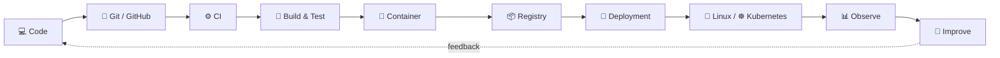

<!--
  JIBAN NIRAULA — GITHUB PROFILE DASHBOARD
  Profile repository: https://github.com/Jiban-Niraula/Jiban-Niraula
-->

<div align="center">


<a href="https://git.io/typing-svg">
  
</a>

<br/>

<a href="https://www.linkedin.com/in/jiban-niraula-595a78352/">
  
</a>
<a href="https://github.com/Jiban-Niraula">
  
</a>


</div>

---

## `whoami`

```yaml
name: Jiban Niraula
current_role:
  - Laravel Developer
  - Aspiring DevOps Engineer

direction: DevOps / Cloud / Linux Infrastructure

hands_on:
  - Linux administration
  - Docker & Docker Compose
  - Git & GitHub
  - GitHub Actions CI/CD
  - NGINX reverse proxy & load balancing
  - Ansible automation

currently_deepening:
  - Kubernetes
  - Terraform / Infrastructure as Code
  - Cloud infrastructure
  - Monitoring & observability

mindset: "Build → Automate → Break → Debug → Improve → Repeat"
```

I started from application development and gradually became more interested in **what happens after the code is written** — how it is built, tested, containerized, deployed, routed, monitored and recovered when something fails.

That curiosity is what pulled me toward **DevOps**.

I am not presenting myself as someone who has mastered every DevOps tool. I am building the foundations through hands-on projects and trying to understand **why the system works**, not only which command to run.

---

## ⚡ DevOps Control Panel

<table>
<tr>
<td width="50%" valign="top">

### 🖥️ Systems

```text
OS              Linux / Ubuntu / AlmaLinux
Shell           Bash
Web / Proxy     NGINX
Containers      Docker / Docker Compose
Version Ctrl    Git / GitHub
```

</td>
<td width="50%" valign="top">

### 🔁 Delivery & Automation

```text
CI/CD           GitHub Actions
Automation      Ansible
Orchestration   Kubernetes
IaC             Terraform
Cloud           Building foundations
```

</td>
</tr>
</table>

---

## 🛠️ Tech Stack

<div align="center">

### DevOps / Infrastructure


### Development Foundation


</div>

> Development is part of my DevOps story, not something I am trying to hide. Understanding applications helps me understand what I am deploying and operating.

---

## 🧭 How I See the DevOps Flow



My goal is to understand every step well enough to **automate it, troubleshoot it and explain it**.

---

# 🚀 Featured Engineering Work

<table>
<tr>
<td width="50%" valign="top">

### 🏫 [HEBS](https://github.com/Jiban-Niraula/HEBS)

**Application + deployment engineering**

Laravel/React school platform with a Docker-based CI/CD workflow.

`Docker` `Docker Compose` `GitHub Actions` `GHCR` `AlmaLinux` `CI/CD`

**DevOps highlights**
- Containerized build and test process
- GitHub Actions pipeline
- Image publishing to GHCR
- Self-hosted AlmaLinux deployment
- Health verification
- Automatic rollback approach

</td>
<td width="50%" valign="top">

### ⚖️ [DevOps NGINX Load Balancer](https://github.com/Jiban-Niraula/DevOps-nginx-lb)

**Hands-on infrastructure lab**

Two WordPress application containers behind NGINX with a shared MySQL database.

`NGINX` `Docker Compose` `MySQL` `Networking`

**Concepts explored**
- Reverse proxying
- Round-robin load balancing
- Container networking
- Shared database architecture
- Failover testing
- Logs and troubleshooting

</td>
</tr>

<tr>
<td width="50%" valign="top">

### 🤖 [Ansible Practice](https://github.com/Jiban-Niraula/ansible_practice)

**Configuration & automation practice**

A learning repository focused on managing multiple servers and reducing repetitive administration work.

`Ansible` `Linux` `Automation` `SSH`

**Focus**
- Inventory
- Managed nodes
- Playbooks
- Repeatable configuration
- Remote administration

</td>
<td width="50%" valign="top">

### 📚 [BookStacks](https://github.com/Jiban-Niraula/BookStacks)

**Application used as a DevOps learning platform**

A library-management project used to explore the path from development to deployment.

`Application` `Containers` `CI/CD Learning`

**Why it matters**
- Connects development with operations
- Provides a real application for deployment experiments
- Supports learning beyond isolated commands

</td>
</tr>

<tr>
<td width="50%" valign="top">

### 🔄 [CI/CD Project](https://github.com/Jiban-Niraula/CICD_Project)

**Pipeline experimentation**

A dedicated repository for learning automated software delivery.

`CI/CD` `GitHub Actions` `Automation`

</td>
<td width="50%" valign="top">

### ✅ [TaskMate](https://github.com/Jiban-Niraula/TaskMate)

**Development foundation**

Laravel-based task management system representing the application-development side of my journey.

`Laravel` `PHP` `MySQL`

</td>
</tr>
</table>

---

## 📊 Engineering Activity

<div align="center">


<br/><br/>


<br/><br/>


<br/><br/>


</div>

---

## 🐍 Contributions, but make it alive

<div align="center">

<picture>
  <source media="(prefers-color-scheme: dark)" srcset="https://raw.githubusercontent.com/Jiban-Niraula/Jiban-Niraula/output/github-contribution-grid-snake-dark.svg">
  <source media="(prefers-color-scheme: light)" srcset="https://raw.githubusercontent.com/Jiban-Niraula/Jiban-Niraula/output/github-contribution-grid-snake.svg">
  
</picture>

</div>

> The snake appears after the included GitHub Actions workflow runs for the first time.

---

## 🧪 What I Actually Like Doing

```text
$ interests --devops

[+] Linux administration
[+] Containerizing applications
[+] Building CI/CD pipelines
[+] Reverse proxies and load balancing
[+] Debugging deployment failures
[+] Automating repetitive server tasks
[+] Kubernetes labs
[+] Infrastructure as Code
[+] Understanding networking between services
[+] Turning manual deployment steps into repeatable workflows
```

---

## 🎯 Current Mission

<table>
<tr>
<td align="center"><b>01</b><br/>Strengthen Linux</td>
<td align="center">→</td>
<td align="center"><b>02</b><br/>Master Containers</td>
<td align="center">→</td>
<td align="center"><b>03</b><br/>Automate Delivery</td>
<td align="center">→</td>
<td align="center"><b>04</b><br/>Orchestrate</td>
<td align="center">→</td>
<td align="center"><b>05</b><br/>Operate Reliably</td>
</tr>
</table>

```text
Linux
  └── Networking
       └── Docker
            └── CI/CD
                 └── Ansible
                      └── Kubernetes
                           └── Terraform
                                └── Cloud
                                     └── Monitoring
```

---

## 💡 Engineering Principles I'm Building Around

- **Understand before automating**
- **Automate what is repetitive**
- **Treat infrastructure as reproducible**
- **Logs are evidence, not decoration**
- **A deployment is not complete until it can be verified**
- **Know how to recover when the happy path fails**
- **Documentation is part of engineering**
- **Keep learning through real systems**

---

## 🤝 Open To

<div align="center">

`DevOps Internships` • `Junior DevOps Opportunities` • `Linux / Infrastructure Projects`  
`Open Source` • `Technical Collaboration` • `Learning With DevOps Communities`

<br/><br/>

<a href="https://www.linkedin.com/in/jiban-niraula-595a78352/">
  
</a>

</div>

---

<div align="center">

### `developer@jiban:~$ ./keep-learning.sh`

**Build. Automate. Break. Debug. Improve. Repeat.**


</div>
